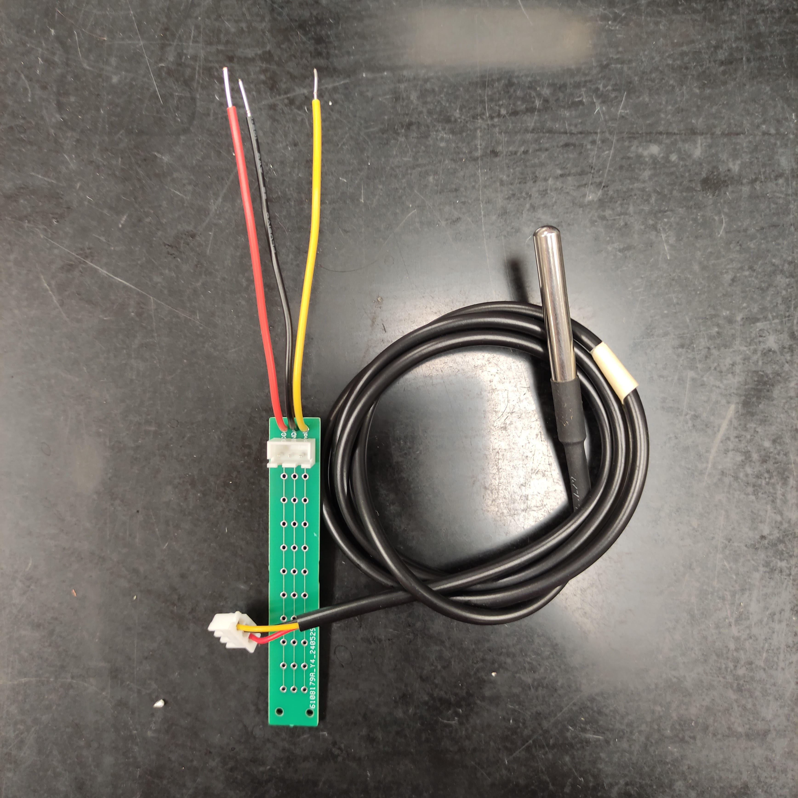
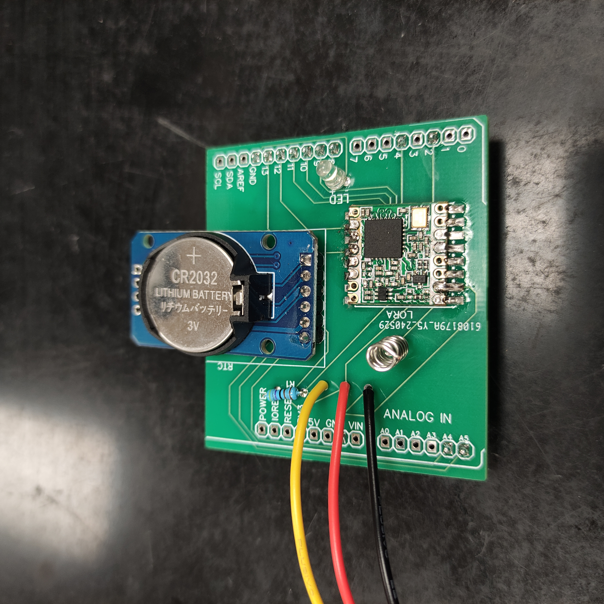

# Network of Temperature Dataloggers

## List of Contents

1. [Objective](#objective)
2. [Data logger working flow](#data-logger-working-flow)
3. [List and bill of Materials](#list-and-bill-of-materials)
4. [Circuit Boards and instructive images](#circuit-boards-and-instructive-images)
5. [Algorithm for Arduino](#algorithm-for-arduino)
6. [Algorithm for LILYGO TTGO](#algorithm-for-lilygo-ttgo)
6. [3D Files](#3d-files)
7. [Necessry modifications](#necessary-modifications)
8. [Points to pay attention](#points-to-pay-attention)

---

## Objective
Develop a data logger to collect temperature data in an inside environment using Arduino, LILYGO TTGO and temperature sensors. It works connected to the power source and saves the sensor data along with the date and time into remote and local databases.

---

## Data logger working flow
Into a loop that repeats every n amount of time (configured by the user, with a minimum of 1 minute), the sensors get the temperature value (on a delay of 35 milliseconds between each sensor reading) and send the data to a LILYGO TTGO board. This board will send the data to a MongoDB database on the internet and store the data in a .txt file inside a microSD card. Along with the sensors' read data, the datalogger ID, date and time are also stored in the databases.

The final .txt file is a line per reading with ID, sensors' data, and date-time all separated by commas.

To send data to the remote database, an API can be used. This [Python API](https://github.com/GustavoSantiago113/TempDataLogger_API) was developed for this purpose. It sends the data and pulls it to be used in a [Visualization tool](https://github.com/GustavoSantiago113/TempVis)

---

## List and bill of Materials

| Material | Amount | Description | Price (USD) |
|----------- | ----------- | ----------- | ----------- |
| Arduino Uno | 1 | This is the brain, where the sensors will be plugged in and information passed to the SD card | 14.99 |
| Sensors DS18B20 + Resistor | 1 (minimum) | They will read the soil temperature | 2.32 |
| LoRa Board | 1 | Send the data from the datalogger to the LILYGO board | 11.45 |
| RTC Watch + Coin Battery | 1 | Provides the minute/hour/date/month/year | 2.6 |
| 3D printed enclosures | 96g | To protect everything | 1.54 |
| microSD card | 1 | Store data | 4.99 |
| LILYGO TTGO | 1 | Receive data from dataloggers, store in microSD card and send to the MongoDB database | 31.9 |
| PCBs, JST connectors, wires, screws, warning LED and male pins | X | Miscellaneous | 1.6 |
| |  | **Total** | 73.39 |

 

---

## Circuit Boards and instructive images
Two circuit boards are made:
1. Connection of all the sensors in parallel. The sensors are connected to the board through a 3-pin JST connector. This board can be connected to the Arduino shield by directly soldering wires in the board or by 3-pin JST connectors;
2. Arduino shield. This board was designed to be connected to the Arduino via male pins and connect the other modules and the sensors' board. 

From the images below, circuit boards were designed in EasyEDA software. The files containing the circuit boards and schematics JSON, and the Gerber files for PCB production are in the folder Circuits.

**
Sensors' circuit board**

**Arduino shield**

---

## Algorithm for Arduino
The algorithm was made in C++ using Arduino IDE since it is for Arduino. It is located in the Algorithm folder, under the name Emissor. The algorithm is structured as follows:

- Declaration of modifiable variables;

- Inclusion of libraries;

- Declaration of variables;

- Setup, that only runs once when the Arduino is restarted. In this function: 
    1. The RTC and LoRa modules are initialized.
    2. The sensors are counted, located and displayed on the screen the hexadecimal address of each one.

- Loop, that keeps running. In this function:
    1. The date and time information are stored in a variable.
    2. The temperature data are obtained, displayed, and stored in an array.
    3. The data is sent to LILYGO via LoRa.
    4. The Arduino sleeps for the amount of period selected;

- Function to print the hexadecimal address of each found sensor.

- In the file sendPacket.ino, the function to send the data via LoRa is defined. 

---

## Algorithm for LILYGO TTGO
The algorithm was made in C++ using Arduino IDE and selected the LILYGO TTGO board. Remember to install the board in the IDE and the driver in the computer. It is located in the Algorithm folder, under the names Local_only, Receiver and Remote_only. As the names suggest, the Local_only stores data only locally, the Remote_only stores data only remotely, and the Receiver in both. The algorithms are structured as follows:

- Declaration of modifiable variables;

- Inclusion of libraries;

- Declaration of variables;

- Setup, that only runs once when the Arduino is restarted. In this function: 
    1. The LED screen and LoRa are initialized.
    2. The SD card is detected and initialized.
    3. The Widi is connected.

- Loop, that keeps running. In this function:
    1. Create a variable to parse the received packet from LoRa.
    2. Reads the packet, separating the text received and storing it in variables.
    3. Store the variables in the SD card.
    4. Parse the variables to a JSON format and send them to the MongoDB database.
    5. Display informative content on the LED screen.

- In the file POSTData.ino, there is the function that creates the JSON using the variables and posts it to the API, which will send it to the MongoDB database.

- The SSID and password of the Wifi are stored in the secrets.h file, among the server URL.

---

## 3D Files
Some 3D files were designed by the author in Fusion360 and printed in a 3D printer, some were files obtained from Thingiverse. All the STL files are in the folder "3D Files". They are holders to stick in place and protect the Arduino + sensor's board and the LILYGO TTGO board.

---

## Necessary modifications
It is necessary to modify the Arduino to fit your project requirements.

On Arduino:
    - Line 4: the desired ID of the respective device.
    - Line 5: the number of temperature sensors you are connecting to this device.
    - Line 6: the time between readings, in seconds.
    - Line 7: the frequency of the LoRa module you are using.

On LILYGO:
    - Line 4: the file of the .txt document on the SD card. It is necessary to keep the "/" and the ".txt".
    - Line 5: the frequency of the LoRa module you are using.
    - In secret.h, set the SSID (WiFi network name), and the password. Also, set the server URL, keeping the "/store". This server URL is the http address in which you can access your server.

---

## Points to pay attention

- Insert the SD card in the LILYGO board after uploading the code, otherwise, the uploading will present errors.
- A white LED was inserted to warn of potential errors. If it turns on, check the Serial Monitor, the problem will be declared on the screen.
- After tests, we observed that the LILYGO connects better with 2.4GHz WiFI networks.
- While connecting the sensors in the board, pay attention to keeping the same wire terminals in the same parallel line of the others.